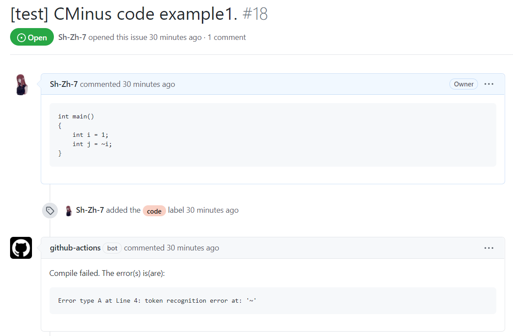

<h1 align="center">CMinus</h1>

<p align="center">Compiler front-end of CMinus, which is the subset of C language</p>

# Usage

See [my porject’s requirements](doc/) for more details.


# Build

You need the meet the following **prerequisites** before the building:

- **JDK**: Java is selected as the target programming language.
- **Maven**: this project use the maven as the build tool.
- **Antlr**: I choose anltr to help us analysis cminus’s syntax.

Firstly, you need to download the project.

```
git clone git@github.com:Sh-Zh-7/CMinus.git
```

Enter the project’s directory and generate the extra source files with antlr. Since these files can be auto generated, I didn’t put them in my repo.

```
antlr4 -o src/main/java/io/github/cminus -package io.github.cminus -Dlanguage=Java -listener -encoding utf-8 -visitor -lib src/main/resources src/main/resources/CMinus.g4
```

Finally you can use maven to get our package and then execute it. Alias to executing jar is strongly recommended.

```
mvn package -Dmaven.test.skip=true
alias cminus='java -jar target/cminus-1.0-SNAPSHOT-jar-with-dependencies.jar'
```

Now you can use `cminus` to interpret the cminus file (with `.cm` suffix)！

Try to execute the following command and watch its output!

```
cminus src/test/resources/examples/example2.cm
```


# Quick Start

I carefully prepare the **Github issue-bot** for you to test my compiler.

Check [this page](https://github.com/Sh-Zh-7/CMinus/issues) to see how you can let the issue bot understand your CMinus code.

Note there is also a [issue template](https://github.com/Sh-Zh-7/CMinus/issues/new/choose) to guide you how to write the correct issue to test.

The effects are shown below:



# License

[WTF License](LICENSE)

Copyright © 2021 Sh-Zh-7


-----

<p align="center"><b>If you like my project, feel free to give my repo a star! :star: :arrow_up:.</b></p>